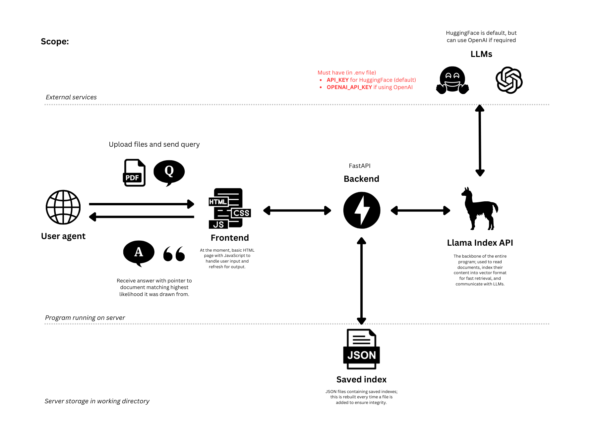

# Document Chat Interface

This project provides a very simple interface for interacting with documents using various language models (LLMs). You can upload documents, ask questions about them, and receive answers along with the sources where the information was found. It uses [FastAPI](https://fastapi.tiangolo.com) to connect the browser to the backend which uses [LlamaIndex](https://docs.llamaindex.ai/en/stable/) to read files, index them for high performance fact retreival, and provide an interface between the LLM.

Features
- It uses FastAPI and LlamaIndex, and runs in a web browser (using basic JavaScript forms)
- Can handle multiple text (PDF) files at once and indexes them to a combined knowledgebase
- Provides provenance of facts retrieved from data i.e. can point to _which_ file it drew facts from
- Can select up to 5 different models, 4 hugging face, 1 open AI (built in API key functionality)
- All routers are asychronous where required
- Minimises calls to LLMs (particularly useful for saving OpenAI credits) by indexing common questions and answers associated with the documents in vector form

## Usage

### Dependencies

Please make sure you've installed the following dependencies in your execution environment:

`pip install llama_index uvicorn fastapi`

### How to Run

1. Run the Backend:
	- Execute `main.py` to start the FastAPI server on localhost using port 8000.
	- Use the following command to run the server: `uvicorn main:app --host 127.0.0.0 --port 8000`
	  
2. Open the UI:
	- Open `main.html` in your web browser. This HTML file will connect to the backend and provide a user interface for interacting with the system’s essential functions.
	- The UI allows you to upload documents, ask questions, and see the results, including the sources of the answers.

3. Interact with the Backend:
	- Once the HTML page is loaded in your browser, you can interact with the backend using the UI provided.
	- You can upload files, ask questions related to the documents, and receive responses along with the documents that contain the relevant information.

### Data Storage

- The directory where you cloned this repository will be used to store uploaded documents and the indexes generated from them. Make sure you have sufficient disk space for storing multiple documents and indexes.

### Environment Variables

- Ensure you have a .env file in the project directory. This file should contain your Hugging Face API key as an environment variable: `API_KEY=your_hugging_face_api_key`

This key is required to access models hosted on Hugging Face.

### Switching Between LLMs

- UI Dropdown Menu:
- You can switch between different language models using the dropdown menu in the user interface.
- This allows you to dynamically choose the model that best suits your needs during your session.
- Adding Future Models:
- To add new models, simply update the selection menu in the HTML code (main.html). Add the model name as an option in the dropdown menu.
- For example, add a new <option> tag with the value set to the name of the model.
- Standalone Version:
- If desired, you can produce a standalone version of this app where the AI models are specified directly as strings representing their names on Hugging Face.

Note: Not all AI models are suited to this type of problem, and some may throw errors or not work at all. Experiment with different models to find the best fit for your needs.

## Future Work

Future improvements may include better error handling for models that are not suited to document Q&A, as well as enhancements to the user interface and backend processing to support a wider variety of models and use cases.

Some features planned:
- Better UI (using bootstrap.css)
- Store text files in an SQL database (for efficient CRUD, and options to protect sensitive documents)
- Support for more models i.e. [Google Gemini AI](https://ai.google.dev/gemini-api?gad_source=1&gbraid=0AAAAACn9t64yRcGSohkIIU6eEXD8f-g_L&gclid=CjwKCAjw_ZC2BhAQEiwAXSgClqOBIQMKVymGTdL-dyMx4D2OwApKcPjqUlAGwuRCamAwRi07v8yObRoC1QgQAvD_BwE) using Google API key
- Implement NoSQL db functionality using [MongoDB](https://www.mongodb.com) to handle metadata of documents, so data can be fixed/corrected manually if incorrect during indexing (plus encrypting metadata to protect sensitive information)
- Protect prompt injection using [LlamaGuard](https://about.fb.com/news/2023/12/purple-llama-safe-responsible-ai-development/) from META or similar technologies
- Implement reference manager features for provenance of fact retreival i.e. Harvard referencing (similar to [this](https://www.citethisforme.com/uk/referencing-generator/harvard) tool) for sources instead of just file name
- Build as a [React.js](https://react.dev) app for containerability

## Attribution

Created by Kavia Shirkoohi as a personal project. Please do not redistribute without permission.
